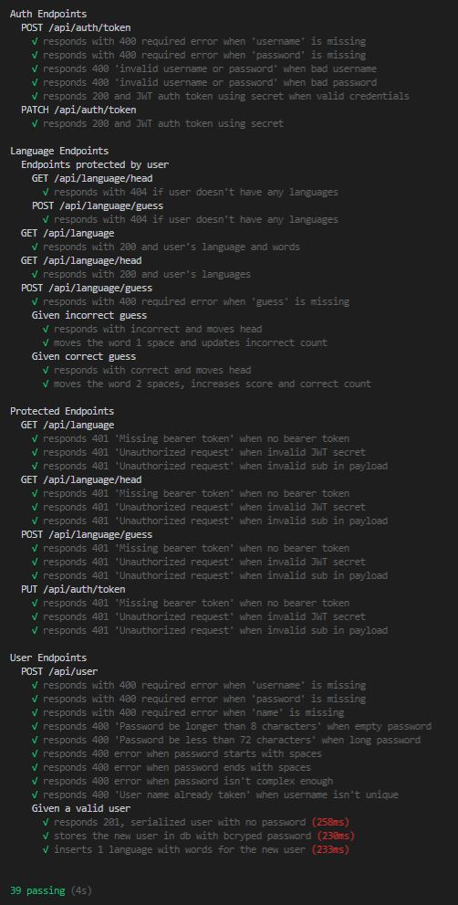

# Spaced repetition Spanish API

## Overview

API built to support the [spaced repetition flashcard web app](https://github.com/williamwdev/spaced-repetition-client-will-hunter). Duolingo & Anki inspired web application with an added feature of utilizing the spaced repetition technique to maximize Spanish vocabulary learning effectiveness. Users are able to securely register and login to their personal account where their personal progress will be saved.  

- [Client-side repo](https://github.com/williamwdev/spaced-repetition-client-will-hunter)
- [Deployed Site](https://spaced-repetition-client.now.sh)

## Spaced Repetition Algorithm Explained
- Given a list of questions with corresponding "memory values", M, starting at 1.
- Take the first question in the list and ask the question
- If the user answers correctly, double the value of M
- If the user answers incorrectly, reset the value of M to 1
- Move the question back M places in the list
- Thus, the words answered incorrectly will be seen more frequently by the user

## Technology Used
- [Node.js](https://github.com/nodejs/node)
- [Express.js](https://github.com/expressjs/express)
- [PostgreSQL](https://www.postgresql.org/)
- [NPM](https://www.npmjs.com/)
- [Knex.js](https://knexjs.org/)
- [Mocha](https://mochajs.org/)
- [Chai](https://www.chaijs.com/) 
- [Supertest](https://www.npmjs.com/package/supertest)
- [Heroku](http://heroku.com/)
- [Heroku Postgres](https://www.heroku.com/postgres)

### Deployment Notes

Check env variables for deployed database `heroku config`

See details of database connection `heroku pg:credentials:url`

Deploy to production `npm run deploy`

When prompt for password or auth token `npm run deploy-password`

`.env` file located in Trello board for project

### Local dev setup for testing

If using user `dunder-mifflin`:

```bash
mv example.env .env
createdb -U dunder-mifflin spaced-repetition
createdb -U dunder-mifflin spaced-repetition-test
```

If your `dunder-mifflin` user has a password be sure to set it in `.env` for all appropriate fields. Or if using a different user, update appropriately.

```bash
npm install
env MIGRATION_DB_NAME=spaced-repetition-test 
npm run migrate
npm run seedtest
```

Ensure postgres server is running `pg_ctl start`
And `npm run test` should work at this point



### Configuring Postgres

For tests involving time to run properly, configure your Postgres database to run in the UTC timezone.

1. Locate the `postgresql.conf` file for your Postgres installation.
   1. E.g. for an OS X, Homebrew install: `/usr/local/var/postgres/postgresql.conf`
   2. E.g. on Windows, _maybe_: `C:\Program Files\PostgreSQL\11.2\data\postgresql.conf`
   3. E.g  on Ubuntu 18.04 probably: '/etc/postgresql/10/main/postgresql.conf'
2. Find the `timezone` line and set it to `UTC`:

```conf
# - Locale and Formatting -

datestyle = 'iso, mdy'
#intervalstyle = 'postgres'
timezone = 'UTC'
#timezone_abbreviations = 'Default'     # Select the set of available time zone
```
